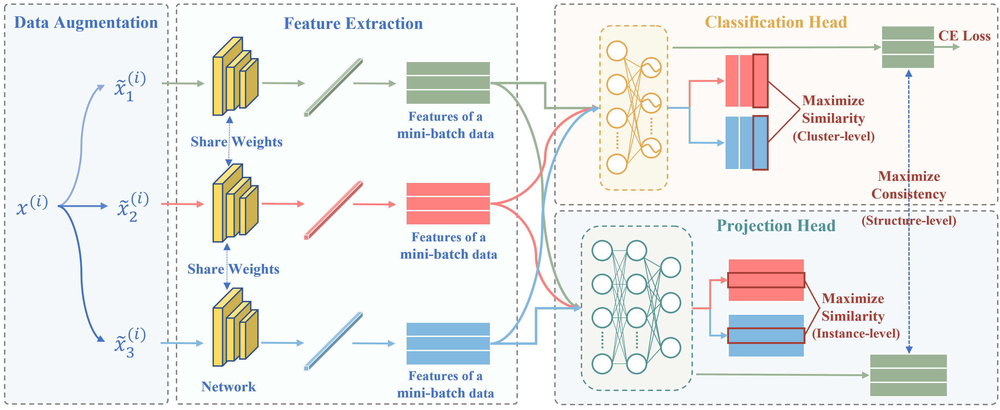

# TCRL: Triple Contrastive Representation Learning for Hyperspectral Image Classification With Noisy Labels
The paper has been published on **IEEE TGRS**, it is available [here](https://ieeexplore.ieee.org/document/10172348).

# Introduction
Recently, hyperspectral image classification (HIC) with noisy labels is attracting increasing interest. However, existing methods usually neglect to explore feature-dependent knowledge to reduce label noise and, thus, perform poorly when the noise ratio is high or the clean samples are limited. In this article, a novel triple contrastive representation learning (TCRL) framework is proposed from a deep clustering perspective for robust HIC with noisy labels. The TCRL explores the cluster-, instance-, and structure-level representations of HIC by defining triple learning loss. First, the strong and weak transformations are defined for hyperspectral data augmentation. Then, a simple yet effective lightweight spectral prior attention-based network (SPAN) is presented for spatial–spectral feature extraction of all augmented samples. In addition, cluster- and instance-level contrastive learnings are performed on two projection subspaces for clustering and distinguishing samples, respectively. Meanwhile, structure-level representation learning is employed to maximize the consistency of data after different projections. Taking the feature-dependent information learned by triple representation learning, our proposed end-to-end TCRL can effectively alleviate the overfitting of classifiers to noisy labels. Extensive experiments have been taken on three public datasets with various noise ratios and two types of noise. The results show that the proposed TCRL could provide more robust classification results when training on noisy datasets compared with state-of-the-art methods, especially when clean samples are limited.

* flowchart
<p align="center">
	<br>
</p>

# Dependency

* python>=3.8, torch >= 1.9
* nni
* scipy, sklearn
* addict, tqdm
* matplotlib

# Usage
* Download the dataset from the [website](https://www.ehu.eus/ccwintco/index.php/Hyperspectral_Remote_Sensing_Scenes), and then modify the **data path** in 'HSI_dataset.py'->'load_dataset(Dataset):'
* Run 'TCRL_main.py' for training and test. The demo is conducted on the UP dataset with 52 clean samples and 24 noisy samples under sym noise type. 
* Other datasets: open the 'configs --> tcrl.py', then modify the following five parameters 'dataset/input_channel/num_classes/train_size/percent', and run 'TCRL_main.py'.

Note: Some results are provided in the folder 'TCRL-result'. Our method has been tested on both Windows and Linux platforms, and the results may vary slightly due to differences in the system and GPU.

# Citation

If you are interested in our repository and our paper, please cite the following paper:

```
@ARTICLE{ZHANG2023,
  author={Zhang, Xinyu and Yang, Shuyuan and Feng, Zhixi and Song, Liangliang and Wei, Yantao and Jiao, Licheng},
  journal={IEEE Transactions on Geoscience and Remote Sensing}, 
  title={Triple Contrastive Representation Learning for Hyperspectral Image Classification With Noisy Labels}, 
  year={2023},
  volume={61},
  number={},
  pages={1-16},
  doi={10.1109/TGRS.2023.3292142}}                                        
```
If there are any questions, please feel free to contact Mr. Zhang (xinyu_zhang@stu.xidian.edu.cn).

Our code is based on [Co-learning](https://github.com/chengtan9907/Co-learning-Learning-from-noisy-labels-with-self-supervision), and the authors are very grateful to Ph.D. Tan for sharing the code. 
